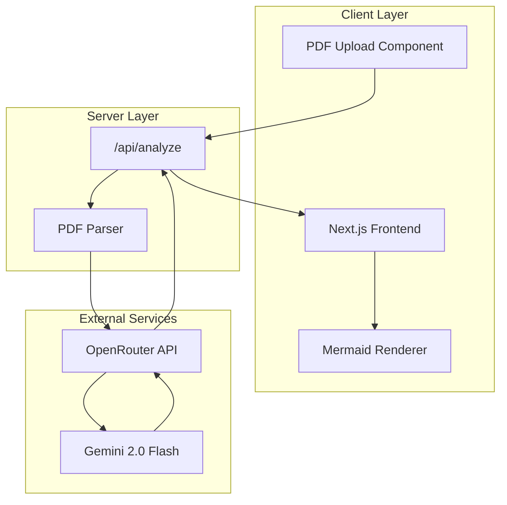
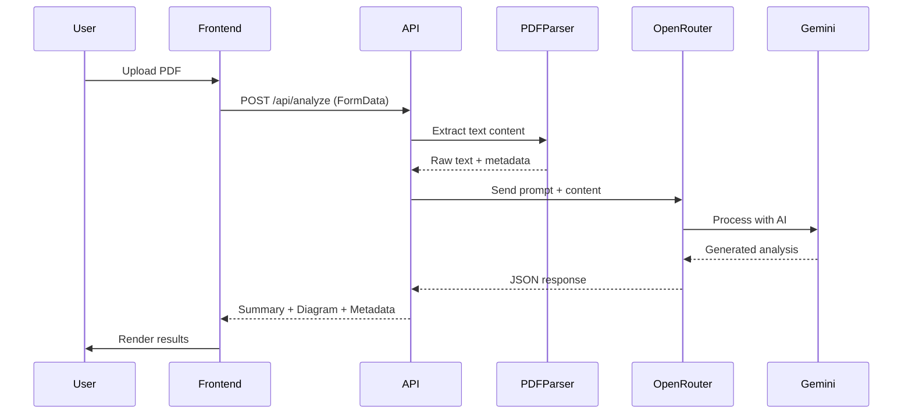
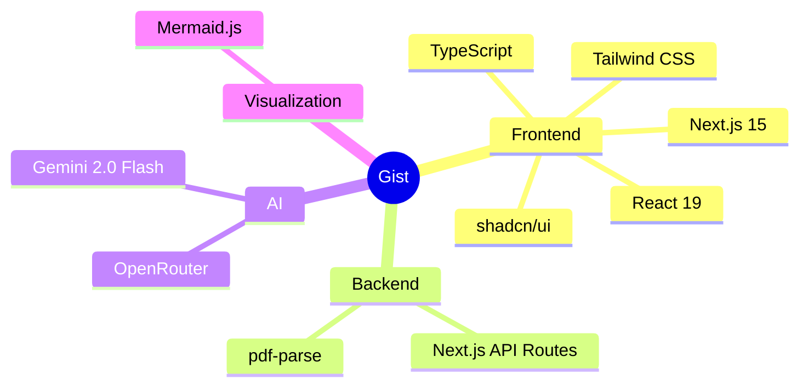
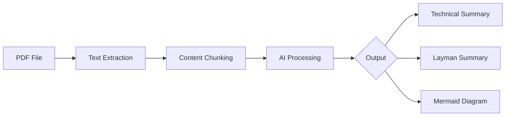
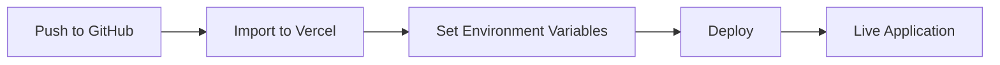

# Gist

**Extract the essence of any document in seconds.**

Gist is a modern web application that transforms PDF documents into digestible summaries using Google's Gemini AI. It provides both technical and simplified explanations, along with visual concept maps powered by Mermaid diagrams.

## Architecture



## How It Works



## Features

| Feature | Description |
|---------|-------------|
| **PDF Upload** | Drag-and-drop or click-to-upload interface |
| **Text Extraction** | Robust PDF parsing with page-level granularity |
| **AI Summarization** | Dual summaries: technical depth + layman accessibility |
| **Visual Diagrams** | Auto-generated Mermaid concept maps |
| **Responsive UI** | Mobile-first design with shadcn/ui components |

## Tech Stack



### Core Dependencies

| Package | Purpose |
|---------|---------|
| `next` | React framework with App Router |
| `typescript` | Type-safe development |
| `tailwindcss` | Utility-first styling |
| `@radix-ui/*` | Accessible UI primitives |
| `pdf-parse` | PDF text extraction |
| `mermaid` | Diagram rendering |
| `react-dropzone` | File upload handling |

## Getting Started

### Prerequisites

- Node.js 18+
- OpenRouter API key ([get one here](https://openrouter.ai/keys))

### Installation

```bash
# Clone and navigate to project
git clone <repository-url>
cd gist

# Install dependencies
npm install

# Configure environment
cp .env.example .env.local
```

Edit `.env.local`:

```env
OPENROUTER_API_KEY=your_api_key_here
NEXT_PUBLIC_APP_URL=http://localhost:3000
```

### Development

```bash
npm run dev
```

Open [http://localhost:3000](http://localhost:3000)

## Project Structure

```
gist/
├── app/
│   ├── api/
│   │   └── analyze/
│   │       └── route.ts      # PDF processing endpoint
│   ├── globals.css           # Global styles
│   ├── layout.tsx            # Root layout
│   └── page.tsx              # Main page
├── components/
│   ├── ui/                   # shadcn/ui components
│   ├── mermaid-diagram.tsx   # Diagram renderer
│   └── pdf-upload.tsx        # Upload component
├── lib/
│   ├── openrouter.ts         # AI client config
│   └── utils.ts              # Utility functions
└── public/                   # Static assets
```

## API Reference

### `POST /api/analyze`

Analyzes a PDF document and returns structured insights.

**Request**

```
Content-Type: multipart/form-data

Body:
  file: <PDF file>
```

**Response**

```json
{
  "technicalSummary": "Detailed technical analysis...",
  "laymanSummary": "Simple explanation...",
  "mermaidDiagram": "graph TD\n  A-->B",
  "pageCount": 12,
  "fileName": "document.pdf"
}
```

**Status Codes**

| Code | Description |
|------|-------------|
| `200` | Success |
| `400` | Invalid file or missing PDF |
| `500` | Processing error |

## Data Flow



## Configuration

### Environment Variables

| Variable | Required | Description |
|----------|----------|-------------|
| `OPENROUTER_API_KEY` | Yes | API key for OpenRouter |
| `NEXT_PUBLIC_APP_URL` | No | Application URL for headers |

### Model Configuration

Default model: `google/gemini-2.0-flash-exp:free`

To change models, edit `lib/openrouter.ts`:

```typescript
const response = await openrouter.chat.completions.create({
  model: "your-preferred-model",
  // ...
});
```

## Deployment

### Vercel (Recommended)



1. Push code to GitHub
2. Import project in [Vercel](https://vercel.com)
3. Add environment variables in dashboard
4. Deploy

### Docker

```dockerfile
FROM node:18-alpine
WORKDIR /app
COPY package*.json ./
RUN npm ci
COPY . .
RUN npm run build
EXPOSE 3000
CMD ["npm", "start"]
```

## Performance

| Metric | Target |
|--------|--------|
| PDF Processing | < 5s for 50 pages |
| AI Response | < 10s average |
| First Contentful Paint | < 1.5s |

## Contributing

1. Fork the repository
2. Create a feature branch (`git checkout -b feature/enhancement`)
3. Commit changes (`git commit -m 'Add enhancement'`)
4. Push to branch (`git push origin feature/enhancement`)
5. Open a Pull Request

## License

MIT License - see [LICENSE](LICENSE) for details.

---

<p align="center">
  Built with Next.js and Gemini AI
</p>
