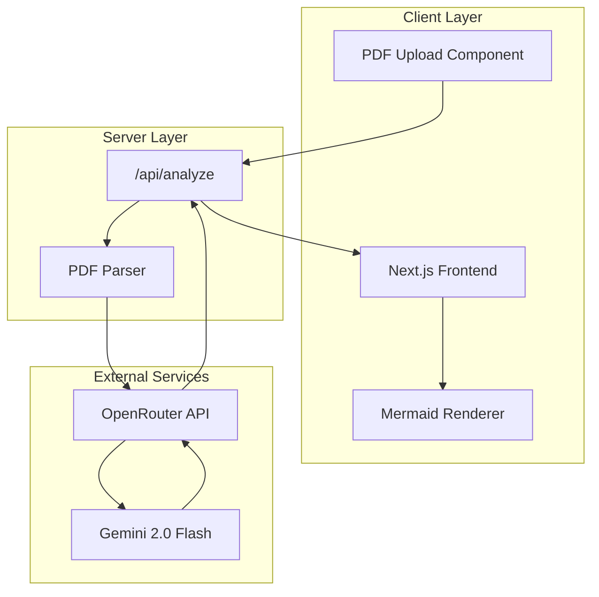
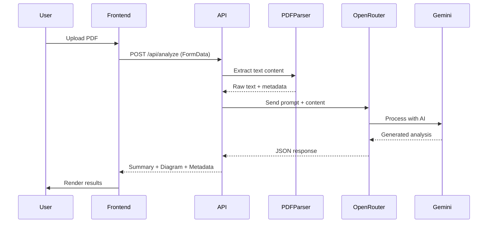
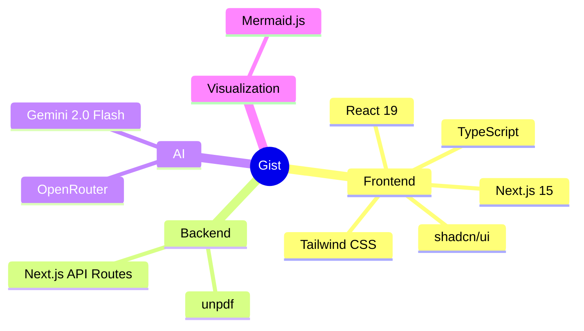
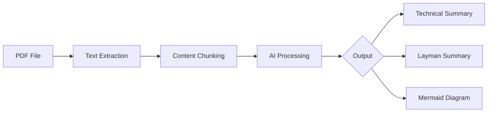
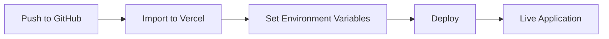

# Gist

**Extract the essence of any document in seconds.**

Gist is a modern web application that transforms PDF documents into digestible summaries using Google's Gemini AI. It provides both technical and simplified explanations, along with visual concept maps powered by Mermaid diagrams.

## Architecture



## How It Works



## Features

| Feature | Description |
|---------|-------------|
| **PDF Upload** | Drag-and-drop or click-to-upload interface |
| **Text Extraction** | Robust PDF parsing with page-level granularity |
| **AI Summarization** | Dual summaries: technical depth + layman accessibility |
| **Visual Diagrams** | Auto-generated Mermaid concept maps |
| **Responsive UI** | Mobile-first design with shadcn/ui components |

## Tech Stack



### Core Dependencies

| Package | Purpose |
|---------|---------|
| `next` | React framework with App Router |
| `typescript` | Type-safe development |
| `tailwindcss` | Utility-first styling |
| `@radix-ui/*` | Accessible UI primitives |
| `unpdf` | Serverless-compatible PDF text extraction |
| `mermaid` | Diagram rendering |
| `react-dropzone` | File upload handling |

## Getting Started

### Prerequisites

- Node.js 18+
- OpenRouter API key ([get one here](https://openrouter.ai/keys))

### Installation

```bash
# Clone and navigate to project
git clone <repository-url>
cd gist

# Install dependencies
npm install
```

**Optional:** Create `.env.local` to pre-fill API key:

```env
OPENROUTER_API_KEY=your_api_key_here  # Optional
NEXT_PUBLIC_APP_URL=http://localhost:3000  # Optional
```

**Note:** Environment variables are optional. You can configure your API key through the Settings UI after starting the app.

### Development

```bash
npm run dev
```

Open [http://localhost:3000](http://localhost:3000)

## Project Structure

```
gist/
├── app/
│   ├── api/
│   │   └── analyze/
│   │       └── route.ts      # PDF processing endpoint
│   ├── globals.css           # Global styles
│   ├── layout.tsx            # Root layout
│   └── page.tsx              # Main page
├── components/
│   ├── ui/                   # shadcn/ui components
│   ├── mermaid-diagram.tsx   # Diagram renderer
│   └── pdf-upload.tsx        # Upload component
├── lib/
│   ├── openrouter.ts         # AI client config
│   └── utils.ts              # Utility functions
└── public/                   # Static assets
```

## API Reference

### `POST /api/analyze`

Analyzes a PDF document and returns structured insights.

**Request**

```
Content-Type: multipart/form-data

Body:
  file: <PDF file>
```

**Response**

```json
{
  "technicalSummary": "Detailed technical analysis...",
  "laymanSummary": "Simple explanation...",
  "mermaidDiagram": "graph TD\n  A-->B",
  "pageCount": 12,
  "fileName": "document.pdf"
}
```

**Status Codes**

| Code | Description |
|------|-------------|
| `200` | Success |
| `400` | Invalid file or missing PDF |
| `500` | Processing error |

## Data Flow



## Configuration

### Environment Variables

| Variable | Required | Description |
|----------|----------|-------------|
| `OPENROUTER_API_KEY` | No | Optional: Pre-fills API key (stored client-side by default) |
| `NEXT_PUBLIC_APP_URL` | No | Application URL for headers |

**Note:** API keys are stored in browser localStorage by default. Users configure their own keys through the Settings UI.

### Model Configuration

Default model: `google/gemini-2.0-flash-exp:free`

To change models, edit `lib/openrouter.ts`:

```typescript
const response = await openrouter.chat.completions.create({
  model: "your-preferred-model",
  // ...
});
```

## Deployment

### Platform Compatibility

This application uses `unpdf` for PDF parsing, which is designed to work across all serverless platforms without native dependencies.

**Supported Platforms:**
- ✅ Vercel (Serverless Functions & Edge Runtime)
- ✅ Render.com (Native Node.js runtime)
- ✅ Cloudflare Workers
- ✅ AWS Lambda
- ✅ Any Node.js environment

### Deployment Constraints

#### Vercel (Recommended)



**Plan Requirements:**
- **Hobby (Free):** ✅ Works for most PDFs
  - Function Timeout: 10 seconds
  - Memory: 1GB
  - Body Size Limit: 4.5MB (default)
- **Pro ($20/month):** Recommended for large PDFs
  - Function Timeout: 60 seconds
  - Memory: 3GB
  - Body Size Limit: Configurable up to 10MB

**Deployment Steps:**
1. Push code to GitHub
2. Import project in [Vercel](https://vercel.com)
3. Add `OPENROUTER_API_KEY` in environment variables
4. Deploy

**Note:** For large PDFs (>5MB) or complex processing that takes >10 seconds, consider upgrading to Pro plan.

#### Render.com Alternative

If you prefer Render over Vercel, the app works on Render's free tier:

**Benefits:**
- ✅ 750 hours/month free tier
- ✅ 90-second timeout (free web services)
- ✅ No cold start issues on paid tier
- ✅ Integrated PostgreSQL

**Limitations:**
- ⚠️ Free tier spins down after 15 minutes of inactivity
- ⚠️ Cold starts can take 30-60 seconds
- ⚠️ PostgreSQL free tier expires after 30 days

**Deployment:**
```bash
# Render will auto-detect Next.js and deploy
git push origin main
```

### Environment Variables

All API keys are configured **client-side** - no server environment variables needed for core functionality.

- OpenRouter API key is stored in browser localStorage
- Users configure their own API keys through Settings UI

For development, you can optionally set:
```env
OPENROUTER_API_KEY=your_api_key_here  # Optional: Pre-fills API key
NEXT_PUBLIC_APP_URL=http://localhost:3000
```

### Troubleshooting

**Error: "Empty response from server"**
- Check if PDF file size exceeds body limit (default 4.5MB)
- Verify OpenRouter API key is valid
- On Vercel Hobby, ensure processing completes within 10 seconds

**Error: "PDF parsing failed"**
- Verify PDF is not corrupted or password-protected
- Check PDF is valid format (not scanned image)
- Try reducing PDF file size

**Previously Used pdf-parse?**

This app migrated from `pdf-parse` to `unpdf` to ensure serverless compatibility. If you're upgrading from an older version:

```bash
npm uninstall pdf-parse canvas
npm install unpdf
```

The `pdf-parse` library required native canvas dependencies that don't work in serverless environments. `unpdf` is pure JavaScript and works everywhere.

### Docker

For advanced deployment scenarios:

```dockerfile
FROM node:18-alpine
WORKDIR /app
COPY package*.json ./
RUN npm ci
COPY . .
RUN npm run build
EXPOSE 3000
CMD ["npm", "start"]
```

## Performance

| Metric | Target |
|--------|--------|
| PDF Processing | < 5s for 50 pages |
| AI Response | < 10s average |
| First Contentful Paint | < 1.5s |

## Contributing

1. Fork the repository
2. Create a feature branch (`git checkout -b feature/enhancement`)
3. Commit changes (`git commit -m 'Add enhancement'`)
4. Push to branch (`git push origin feature/enhancement`)
5. Open a Pull Request

## License

MIT License - see [LICENSE](LICENSE) for details.

---

<p align="center">
  Built with Next.js and Gemini AI
</p>
